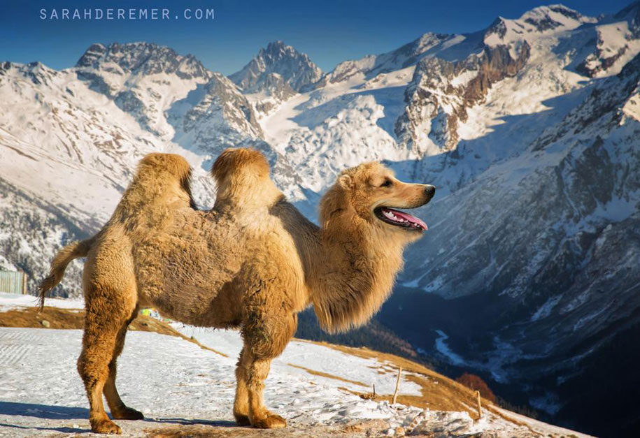
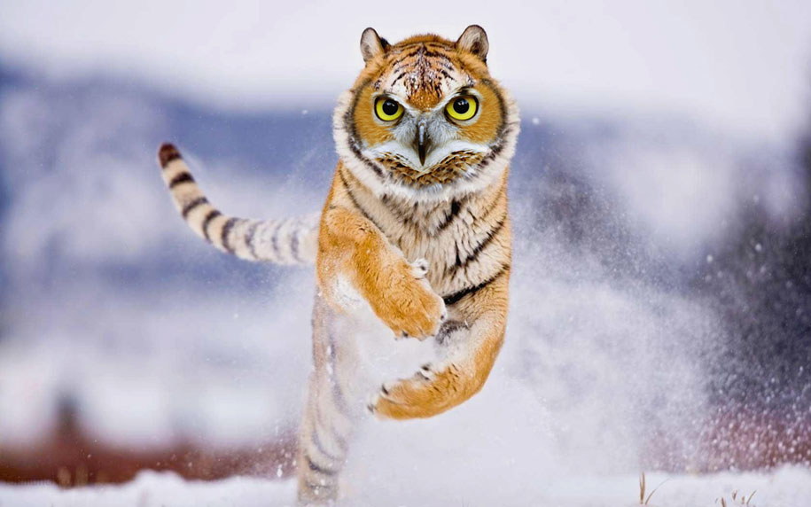
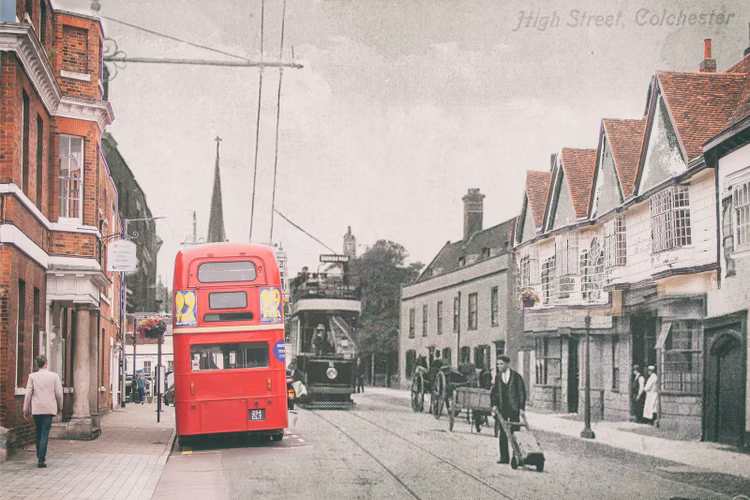
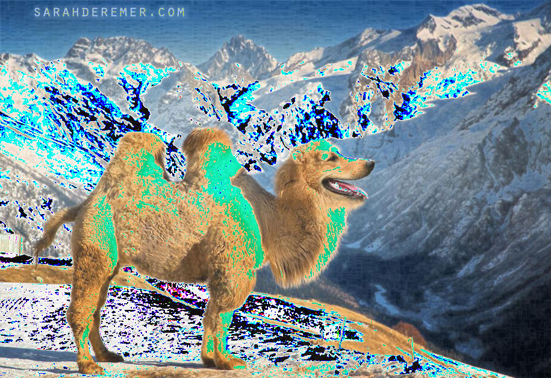
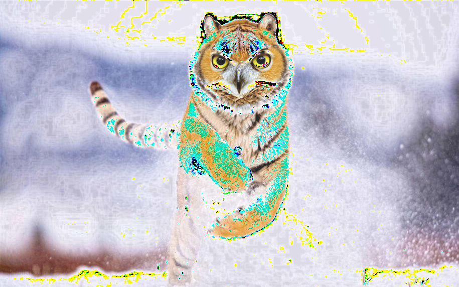
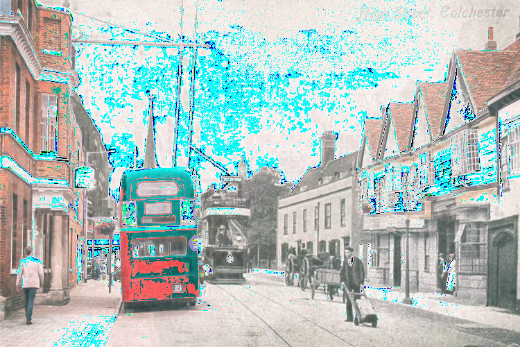

# IsItPhotoshopped ✨

Hey there, Gen Z peeps!  Welcome to **IsItPhotoshopped**, the ultimate GitHub repo that's here to unravel the mystery behind those too-good-to-be-true images. ️‍♂️ Ever stumbled upon a pic and thought, "Wait... is this for real or just another masterpiece of Photoshop magic?" Well, ponder no more! Our project dives deep into the pixel universe to spot those sneaky edits. ‍♂️✨

## What's the Tea? ☕️

In a world where seeing is *supposed* to be believing, **IsItPhotoshopped** steps up as your digital truth serum. By analyzing image entropy (yeah, we're talking some serious mathy vibes here), we can hint at which pics might have been tampered with. Whether it's a camel looking a tad too majestic or a cityscape with suspiciously perfect weather, we're on it!

## Getting Started

1. **Clone This Repo**: Grab all the goods with a simple `git clone`. This will get you all the scripts, plus a set of example images that we've already put under the microscope.

2. **Requirements**: Make sure you have Python installed along with PIL (Pillow), and `tqdm` for those cool progress bars. Run the following command in your terminal to get your environment ready:

    ```bash
    pip install -r requirements.txt
    ```

3. **Dive Into the Code**: The main script is where the magic happens. It calculates image entropy, compares it, and lets you see which parts of an image might be shouting "I'm Photoshopped!"

4. **Contribute**: Got ideas? See something off? Jump in and contribute! Whether it's refining the entropy calculation or suggesting new features, we're all ears.

## Example Galore ️

Curious to see some before and after action? Check out the `examples/` directory for a peek into our digital lab:

- **Originals**: Spot the reality with these images:
- Camel Image:  
- Tiger Image: 
- London Image: 
- **Modified Marvels**: Witness the wonders of entropy magic with these images:
- Camel Modified Image: 
- Tiger Modified Image: 
- London Modified Image: 

## Join the Party

**IsItPhotoshopped** is more than just a project; it's a community of curious souls eager to peel back the layers of digital artistry. So, whether you're here to learn, contribute, or simply marvel at the mysteries of image processing, you're in the right place.

Don't forget to star ⭐ the repo if you find it cool, and follow us for more updates. Let's demystify the digital world together, one pixel at a time. 🌈 ✨.
